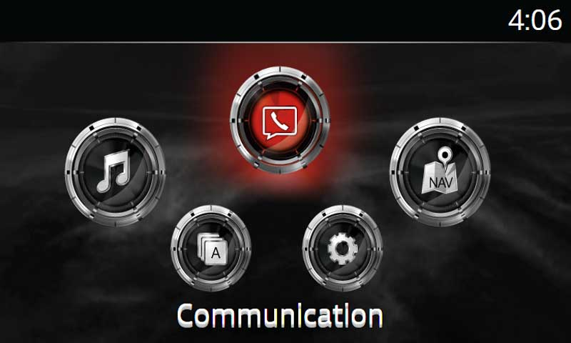
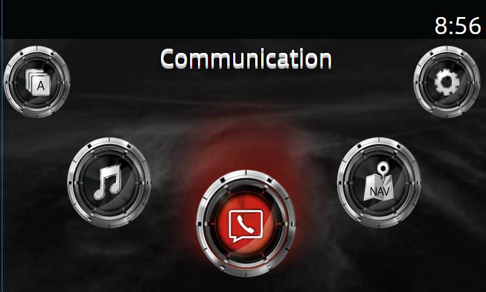

# MZD-AIO-TI 2.x.x CHANGELOG  
##### FOR [AIO v1.x.x CHANGELOG](https://github.com/Siutsch/AIO---All-in-one-tweaks/blob/master/CHANGELOG.md) or visit [MazdaTweaks.com]

#### 2.5.10
-  Reworked v59 App List Patch
  -  Pro: Menu structure will no longer be broken (VSM submenu will be restored)
  -  Con: All apps that can come up on the list need to be added to the 'additionalApps' array in systemApp.js (I included every app I have ever seen or heard of including CASDK apps in the array you will only need to add custom developed apps)
-  Patch to Full Restore Script to prevent potential bootloop when running with 'delete backups' option several times in a row.
-  Replaced missing speedometer images
-  Adjusted CastScreen, may fix issues for some.

#### v2.6.0
##### App List Patch Rework For v58-v59
For v58+ app list will go back to normal (with vsm sub-menu context) and additional apps will appear in the main list.
One down side: All custom apps have to be added to array `additionalApps` in systemApp.js (first line) to appear in the app list.  I included every app I have seen or heard of including all known CASDK and native apps so you will only have to add any custom apps that you have developed yourself.

#### Bug Fixes
- Replaced Missing Speedometer Images.
- Choosing Speedometer in Statusbar will auto-select Date to Statusbar Mod

#### 2.5.9  
#### SSH_Bringback:
- A second root user/pass - jci/jci is now added.
- This is to give AIO a unique user to check the passwd file to ensure SSH is actually re-enabled.
- Added 'Force SSH' option that will force update SSH settings. For FW < 56.00.511 this will change the root user to cmu (and add second root user jci).
  - I personally did this on my v55.00.753A-NA and added a few of my own root usernames as well.
- For more information I am adding a 'Pro Tips' page to MazdaTweaks.com The first entry will be about the importance of SSH access + how to add your own user/pass to your system.  
#### JCI backup
- Zip Backup Option
  - Creates a .zip file containing your backup JCI folder
  - Takes longer than a regular backup
  - You cannot create both a regular backup and a zipped backup in the same installation, that would take a very long time.
- When an unknown firmare version is encountered AIO now does one of 3 things:
 - If FW < v55: Shows user a message that AIO is not compatible and they need to update to FW v55+ to use AIO.
 - If FW >= 58: Shows user a message that AIO is not compatible and a choice is given to make a JCI backup and instructions on where to send it to test for compatibility.
 - If FW = 55 or 56: All FW v55 & v56 will pass the initial compatibility check but **may not pass compatibility checks for certain tweaks** meaning those teaks will be skipped during installation.
  - Email aio@mazdatweaks.com if you need assistance with an incompatible firmware, unless you are have FW less than v55 then just update to v55 or higher.  
##### Added Compatible FW:
  - 59.00.446A-NA
  - 59.00.450A-NA
  - 59.00.447A-EU
  - 59.00.449A-EU
  - 59.00.449A-ADR
  - 59.00.450A-ADR

####  2.5.6

- PATCHES:
  - Fixed the Error Message Display in the VideoPlayer
    - It says to reboot your CMU but sometimes exiting and reopening the app is enough
    - Of coarse if it keeps happening then reboot
  - Fixed a typo in the 'order of audio source' tweak
  - Fixed transparency in images when resizing especially 'blank album art'
    - Electron changed something in the resize API, now its faster. Cropping may be coming soon too!
  - Fixed Boot Animation compile failing whey no option is chosen
  - Temporary Remove Criss-Cross Boot Animation (Not Working)

#### 2.5.5
- **VIDEO PLAYER V2.9**
  - Full multicontroller functionality
    - Scroll and Select Video List (cw/ccw - select)
      - List looping in selection and playback
    - Scroll and Select Options (tile-right/left - select)
  - Previous track
    - Play Previous Video
  - Repeat all option
    - Recently Played Videos are not repeated in shuffle mode until the entire list is played.
    - Toggling Repeat All will clear recently played videos list.
  - Save Configuration To Local Storage
    - Utilize the CMU's Local Storage to save options even after a reboot.
    - All option choices AND recently played video list are saved to local storage.
  - More Touch Controls During playback
    - Control next/prev/ff/rw and more by tapping sections of the touch screen.
    - See [Touch Screen Control Map](app/files/img/scrnCtrlMap.jpg) for details
 - Removing Navigation SD card **will improve video player performance** this is due to the memory issues that exist within the MZD system.
 - Installation of the swapfile will also improve performance, swap mounting has been improved.

##### Want more info on the Video Player? Check out the [Video Player Repository](http://trevelopment.win/videoplayergithub)

- **CUSTOM BOOT ANIMATIONS**
  - Change all or part of the boot animation (Default 'Disabled' Animation Uses Default LoopLogo for all 3 parts of the sequence allowing for the shortest boot time the illusion of no boot animation)
  - Boot Animation Sequence Goes: LoopLogo[1] => TranLogo[2] => TranLogoEnd[3]
  - Choices:
    - Mazda Logo (Default LoopLogo) [All]
    - Matrix [All]
    - Mazda Z Loop [All]
    - Large Mazda Tran [All]
    - Mazda Cinema [Loop - 1 & 2, end 3]
    - Criss Cross [Loop - 1 & 2, end 3]
    - Mazda Race [Loop - 1 & 2, end 3]
    - Fiat Logo [1]
    - Spider 124 Tran [2]
    - MZD Title Slam [3]
    - MZD Space Logo [3]
    - Car Flash [3]
    - Default Animations Are Also Included As Choices
  - *In App Preview of Boot Animation*
___
- BUG FIXES / CHANGES
   - Fixed error when choosing CarOS theme
   - Improved SwapFile Mounting
   - SSH_Bringback is now selected by default
   - App List Patch is automatically applied to v59 when installing apps if no-more-disclaimer and order of audio source list are not installed
   - Some Layout Improvements
   - Media Order Patch and FLAC Support can be chosen under 'Advanced Options'.  Wifi and SSH are FORCE INSTALLED if this tweak is chosen.
 - **Unconfirmed Fix For CastScreen**
   - **Adds Port 53515 (ADB Default Port) To Firewall IPTables Accepted Connections**
   - If this fix works for anyone let me know.

___
#### 2.5.0
## IMPORTANT: DUE TO A [DMCA TAKEDOWN](http://trevelopment.win/DMCA) ALL FILES ASSOCIATED WITH THE SPEEDCAM PATCH, NNG, IGO AND ANY NAVIGATION PATCHING TOOLS ARE NO LONGER AVAILABLE WITH MZD-AIO-TI.
### This will allow for continued development of this project without infringing on the copyrights of NNG Kft. and potentially causing the company to target developers and/or users to sue for Copyright Infringement.  Additionally, no information regarding speedcam or navigation patching will be available or provided through MZD-AIO-TI or any associated developer of MZD-AIO-TI.
##### **Uninstall for speedcam patch will be available but is _deprecated_ and will eventually be removed**
**Thank you for your cooperation reguarding these matters**
___
##### 2.4.3
- VIDEO PLAYER MUTICONTROLLER!
  - ButtonPress = Play/Pause
  - Tilt-Right = Next
  - Tilt-Left = Stop
  - Tilt-Up/Down = Scroll Video List
  - Rotate-CC/CCW = RW/FF
    - RW/FF Frame skip time lowered from 30s -> 10s
    - Because with the wheel rotation, 30 second jumps are too much
- Speedometer Variant Option:
 - Start App In Analog Mode
##### 2.4.2
- Reverted Compatibility for 'Media Order Patch & FLAC Support' tweak.
  - Compatibilities with issues are neatly commented out in the code for  testing purposes.
  - Toned down the warning message.
  - I appreciate all those who help out on this issue, Lets try getting these compatibilities all straightened out.
- Choosing 'Media Order Patch & FLAC Support' will auto-choose SSH_Bringback (It can be unselected but that is not recommended).
- Speedcam Patch Compatibility should be ok but should be **considered a beta test for FW. ver. 59.00.411A-NA & 59.00.443C-EU.**

##### 2.4.0 Release
- **Android Auto Bugfixes**
 - re-enables the dialer interface if the phone is paired and connected to the headunit via BT (Not Completely fixed, Still an Issue)
 - fix issue for screen corruption with backup camera
 - Increase the size of the USB receive buffer to 16384
- I was a little nervous while confirming this because I have run AIO in my car hundreds of times - To apply "Remove Message Replies" tweak you **must factory reset your settings after installing**.
  - Since nothing bad happened to me after countless experimental system modifications, it is unlikely that factory resetting options would cause any damage.
  - Edit messages for your language in blm_msg-system.xml to start with your own preset messages.
- 2 new smooth themes by Zephnath
 - Smooth Azure (Blue)
 - Smooth Violet (Purple)
- Added Compatible Firmware: v56.00.403A-JP
- SSH Bringback
 - Compatibility extended to all FW v56.00.511 - 59.00.443 (Prior to v56.00.511 SSH is already enabled)
 - New user/password will persist through firmware upgrade. [For More Information View This Infotainment Project Thread](http://trevelopment.win/SSHBringback)
  - New User: cmu
  - Password: jci
 - *New Username and Password will only apply to installations from this point on*
- ~~Media Order and FLAC Support Compatibility:~~
 - ~~59.00.330A-ADR~~
 - ~~59.00.342A-ADR~~
 - ~~59.00.441A-NA~~
 - ~~59.00.443C-EU~~
- Speedcam Patch Compatibility:
 - 59.00.441A-NA
 - 59.00.443C-EU
- UI Fixes
  - Fixed some colors in Dark Mode.
  - Bits of Resizing and shifting.
  - Font change.
___
##### 2.3.6
- Fixed Android Auto Install To Clean Up Old Config If Already Installed (Causing "Can't connect to headunit process" Error)
- Added Speedometer Variation By: pnedkov
 - Tap Screen To Switch Between Analog & Digital Style Speedometer

##### 2.3.3
- Fixed Android Auto Install
- Moved Backup options to a Pop-out 'Install Options' panel on the top-left side
- Added a 'Skip Confirmation' Option (Also in the Install Options Pop-out Panel)
- Added a 'Compatibility Check' view to clarify Compatibilities (Under the 'Help' Menu)

##### 2.3.1:
- Fix Bug with Compass and Speedometer in v59+ (noNavSD = true;)
- Added 'Remove List Loop Beep' Option

#### 2.3.0:

##### Video Player v2.7 Update - IS AWESOME THANK YOU VIC_BAM85!!!
- New Controls in full screen mode:
 - Tap (& hold) left side to rewind
 - Tap (& hold) right side to fast-forward
 - Tap center to pause-play
- Works better and Looks better too!
- No need to uninstall, just install over old Video Player to update

##### Android Auto v1.02 Update - By: Khantaena
- "Android Audio" menu option no longer starts the process, instead it tells the phone to ask for video focus again if you have pressed the physical "Home" button and left the AA UI.
- Refactor code into a long-running service that starts on CMU boot. Allows auto-start on phone connection.
- Fix bug in focus handling when the audio focus is lost externally. No longer gets stuck unfocused
- Audio and video focus can now be gained/last at will and restore previous focus. This allows you to play the radio but also receive navigation prompts (for example) or use the CMU UI while playing music via AA.

##### NNG Patch Tool v1.4 Update - By Modfreakz!

##### 6 New Themes
- Smooth Red
 - Fully Smoothed Out Theme Changes Everything - Very Awesome
- Storm Troopers
  - Storm Trooper Style Coins
- Poker
 - Playing Card Coins
- Mazda Logos
 - Mazda Logo Coins
- Floating Logo
 - Invisible coins - Selected Coin shows Mazda logo
- X-Men
 - X-men Character Coins

__Mix and Match Themes with Main Menu Layouts.__

_Pro Tip -_ Install partial color scheme by deleting some of the images before installing.  
##### Custom Theme Support
- Download any premade theme and use with MZD-AIO-TI
 - Download from: [List of MZD Themes](http://trevelopment.win/MZD-themes)
 - Forum: [Corwin9s's Themes for MZD Connect](http://mazda3revolution.com/forums/2014-2016-mazda-3-skyactiv-audio-electronics/186218-corwin9s-s-themes-mzd-connect.html)
- Install your own custom made theme

###### New Backgrounds
- To go with the new Themes

###### Bug Fixes:
- Fixed Semi-transparent-parking-sensor Uninstall (Replaced All Missing Images)
- Some Tweaks not showing for certain languages

**Compatible Firmware Version: 56.00.514A-ADR**
___
#### 2.2.4:
 - Better Comments - If You Like To Look At The Code
 - Fallbacks Are Commented Out - So If You Really Need One You Can Get It
  - This Leaves Only One Assumption That AIO Follows: Any File That Has Been Modified Will Have A Backup Of The Original As A .org File.
  - The Only Way This Assumption Is Broken Is If Modifications Were Made To A File Before AIO And No Backup Was Created.
- Italian Language For Speedometer App
- _Option For Touchscreen Tweak:_ **Fix Cluster Compass**
 - Some Settings Will Be Disabled While Driving But The Touchscreen & Compass Will Work.
- _Option For Main Menu Tweaks:_ **Smaller 'Coins'**
 - Half Sized Main Menu Coins.
- _Backup Saving Options:_ (Image File Are Not Backed Up)
 - **Copy Backups:**
   - Copies The .org Backup File Of All Modified Files To Your USB Drive
 - **Test Backups:**
   - Some Tweaks Will Copy Before And After Copies Of The Files They Modify To Your USB Drive.
- Updated The Translator
- Updated Remove Message Reply File - Deleted Unnecessary Line Breaks, Might Get It To Actually Work Soon
- Added Compatible Firmware Versions
 - 58.00.251A-ADR
 - 59.00.342A-ADR
 - 59.00.442A-ADR
 - 59.00.443C-EU
 - 59.00.443C-ADR
- Small change to build logic - All relevant option variables are loaded at the beginning of the tweaks.sh

#### 2.2.0:
**MAJOR CODE REFACTORING**
###### Tweak Files - All around improvements in coding style, efficiency, logging, compatibility, commenting, and error handling
###### IF YOU HAVE PREVIOUSLY INSTALLED NO-MORE-DISCLAIMER, ORDER OF AUDIO SOURCE LIST, OR IMPROVED LIST LOOP MOD ON FW V59 PLEASE REINSTALL (OR UNINSTALL) BECAUSE THE FILES USED IN YOUR INSTALLATION WERE NOT UPDATED TO YOUR FIRMWARE.
###### ALSO, YOU MUST INSTALL NO-MORE-DISCLAIMER OR AUDIO SOURCE LIST ORDER (OR BOTH) FOR APPS TO APPEAR IN THE APP LIST ON V59 ALL UPDATED FILES IN AIO V2.2.0 WERE UPDATED FROM FW V59.00.441A-NA SO CONTINUE TO BE CAREFUL (THOUGH ALL FW V59 SHOULD BE COMPATIBLE SINCE USING FILES FROM V55 ON V59 WAS STILL WORKING FOR THESE TWEAKS).
##### NEW TWEAKS
- _NEW_ **Main Menu Tweaks:**  | _Pure CSS | No File Replacements | Compatible With All FW Versions_
- Hide The Main Menu Ellipse
- Give Main Menu Label a '3D' Effect
- *Two Alternative Main Menu Layouts*
  - **'Star Points' Layout**
  - **'Inverted' Layout**

- **Text Style Tweaks**
  - Added Song Title Color
  - And Radio Station Title Color As Options
  - Text Shadow (Global It Is More Noticeable Against Light Colored Backgrounds)

##### Notable Changes:
- 'Date To Statusbar mod' and 'Statusbar Tweaks' are now combined.  
  - Date to Statusbar Mod v3.3 (like v2 but with 3 clear date format choices)
  - Clock Color Also Applies to Statusbar-Mini-Speedometer (Even In Reverse :+1:)
  - Status Notification Color Includes all types of notifications (not just nav).
  - **IT IS RECOMENDED THAT YOU UNINSTALL THE DATE TO STATUSBAR MOD V2 BEFORE INSTALLING V3.  IT IS NOT REQUIRED BUT IT WILL PRODUCE BETTER RESULTS.**
- Date To Statusbar Mod v3.3 is compatible with all FW v55-v58 and:
  - 59.00.330A-EU
  - 59.00.331A-EU
  - 59.00.330A-NA
  - 59.00.441A-NA
  - 59.00.443A-NA
  - 59.00.443C-ADR
  - 59.00.326A-ADR  
- Mini Speedometer automatically hides the notification border without date to statusbar mod
- Fixed a typo causing the blue nav color scheme to fail to uninstall.  Now it is removed when changing back to default (red).

### I Will take suggestions for layouts, Just mock up your Idea in Photoshop or paint or for you software freedom lovers [GIMP2](http://gimp.org)
#### **'Star Points' Layout**:

#### **'Inverted' Layout**:

(Main Menu Label On Top Of The Screen Under Statusbar)

___
#### 2.1.5
- UI Style Tweaks:
  - Body Text Color - Audio Artist & Album Title + more
  - Song Title Color
  - List Item Color
  - Disabled List Item Color
- ReCoded Tweaks for better compatibility:
  - Pause On Mute Tweak is now compatible with all FW versions - No longer replaces files
  - No Background Behind Buttons - Hides the background images with CSS rather than replacing them with transparent images
  - Better logging
- Blue Color Scheme Now Includes Blue Navigation Color Scheme
- Android Auto Install Works!

#### 2.1.3:
- Fixed Issue with installation not starting.
- Window state is now saved on exit and restored upon reopening. For real this time.
  - Added a menu Icon to reset window size and position.
-
#### 2.1.2:
- Background Rotator will now rotate up to 50 backgrounds (Larger backgrounds will take longer to load)
  - Also set the number of seconds each background will show: from 10 - 300 seconds (5 minutes)
- Fixed Speedometer and video player.
- 3rd attempt at fixing Android Auto (3rd time's the charm?)
- Beginning to standardize tweak installs/uninstalls.
- Fixed some corrupt binaries.

#### 2.1.0:
**NEW TWEAKS!!**
- Statusbar Tweaks
  - App Name Color
  - Clock Color
  - Nav Notification Color
  - Remove Statusbar Background Image
  - Set Statusbar Opacity
- Off Screen Background
  - Set a background image for "Turn Display Off and Show Clock" in the Settings Menu.
  - Will also display on system shutdown
- Added MPG or Km/L choice for Fuel Consumption Tweak
- Hopefully all tweaks are working correctly
  - Need additional confirmation for Android Auto (issue AA just shows a black screen)
- Background preview shows statusbar tweaks
- Added preview buttons to trigger background preview
- Added Tipperary font for background preview
- Retrieves FW version from previously used USB drive
- French Translation By: Salegosse (Mazda3revolution.com)
___
#### 2.0.6:
- Copy buttons for text fields on translator page.
- Added a top bar and clock to the background preview.
- Now compatible with 32 bit Windows
- Fixed Castscreen Receiver and put apk in its own folder
- Fixed Android Auto

#### 2.0.5:
- Initial language chosen for Speedometer Tweak based on locale (Fallback to English if locale does not match any provided translations or is not found.)
- Speedometer: Km/h selected by default except en-US (mph if locale = en-US).
- Selecting Speedometer_to_Statusbar options now auto-select date_to_statusbar mod 2.2 (km/h) except en-US (v2.3 if locale = en-US).
- Fixed Uninstalling Color Scheme to also remove blue nav color scheme if installed
- Warning message during tweak install for FW: 59.XX.XXX about apps not showing up in the app list.
- Added some HINT messages during Compilation
- Added Infotainment Frame to background preview

#### 2.0.4:
- Fixed bug when choosing Swapfile tweak and not copying directly to USB Drive.
- Fixed bug where Patched files were not copying for Speedcam Patch
- Formatting fixes
- Bug fixes
###### New Key bindings:
- Ctrl + Alt + H
 - Opens Main Page (Home)
- Ctrl + Alt + J
 - Opens Photo Joiner Window
- Ctrl + Alt + K
 - Triggers Start Compile
- Ctrl + Alt + L
 - Opens Translator Page

#### 2.0.3:
- Updated Patching Tool 2.3 (Thanks Modfreakz!).
- Added Compatible fw v.56.00.100A-EU.
- Added Compatible fw v.59.00.441A-NA.
- Updated date_to_statusbar to reject if FW = v.59.x+
- Snackbar messages
- Less intrusive alert of available update using Snackbar (and Native Notifications on Windows 10)
- Trigger changelog message after update.
- Added help panel info (Contributing section).
- **EXPERIMENTAL FEATURE: GOOGLE TRANSLATE** Can be found in Help & Settings Menu. (Some languages will break the formatting)
- GOOGLE TRANSLATE pop-up on the translator page to assist with translations.

#### 2.0.2:
- Clean up code/Improvements in logging
- **Updated Android Auto** with the latest binaries.  Should be stable now but needs additional testing to confirm

#### 2.0.1:
- Automatic Updates
- Delete _copy to usb_ folder after copying to USB Drive option  

## New Features in AIO 2.0.0:
* Completely Rebuilt Desktop App GUI.
* Ability to install and uninstall tweaks in the same installation (Be careful this is a Beta feature).
* Tweak files for 'Color Scheme' (105MB) and 'Speedcam Patch' (207MB) are downloadable extras to keep the app size small.
* Choose an image to replace your infotainment background, automatically resized to 480x800px to fit the screen.
* Replace blank album art with any image, automatically resized to 146x146px.
* Image-Joiner for joining multiple images for the 'Background Rotator' tweak. Each Image is resized to 480x800px.
* Also, a choice to upload an image that will not get resized for background rotator.
* Separated the 'Improved List Loop' and 'Shorter Delay Mod' into individual tweaks.  
* Choice for 'Enable Wifi' and 'CID to SD' tweaks (enabled by default).
* Choice to use color scheme background or not.
* More information and backups are collected during tweak installation (For planned 'Save Backups to PC' and 'System Analysis' tweaks).
* Copy Files to USB Drive (works for a single plugged in drive or choose 1 out of a list of all available external drives)
* Save/Load tweak options.
* All 40+ tweaks from [AIO 1.x][1] with variations.
* Automatic Updates.
* Updated to most current version of Android Auto.
* More to come!

#### - Image formats supported: .png .jpg .jpeg .bmp .tiff
#### - Images are converted to .png format

#### - Built in Translator
 ***
[Electron]: (http://electron.atom.io/)
[AngularJS]: (https://angularjs.org/)    
[MazdaTweaks.com]:(http://mazdatweaks.com/)
[NodeJS]: (https://nodejs.org/)
[Chromium]: (https://www.chromium.org/)
[1]: (https://github.com/Siutsch/AIO---All-in-one-tweaks)
