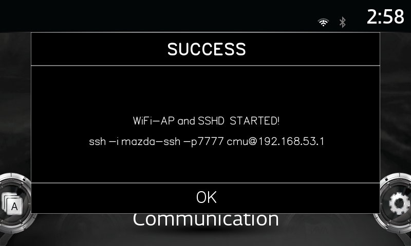

# temporary-ssh-access

SSH on demand.



http://mazda3revolution.com/forums/2014-2016-mazda-3-skyactiv-audio-electronics/57714-infotainment-project-584.html

# Description
[README.txt](README.txt)


# Step

1. Download `cmu-autorun/sdcard/temporary-ssh-access/*` to USB
2. Plug USB in cars and wait dialog
3. On PC connect WiFi name : CMU-XX:XX:XX:XX:XX:XX
4. use ssh client connect to 192.168.53.1 with key `mazda-ssh` in `cmu-autorun/sdcard/temporary-ssh-access/mazda-ssh`

```bash
ssh -i mazda-ssh -p7777 cmu@192.168.53.1
```
